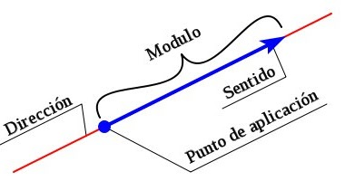
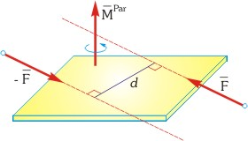
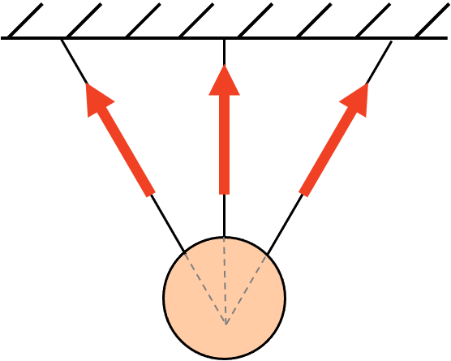
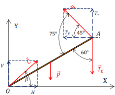
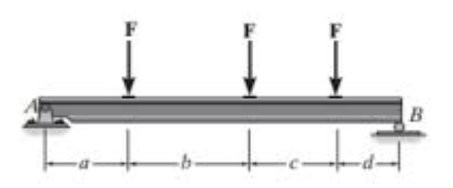
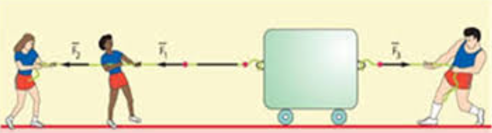
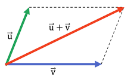

## Introducción y Conceptos Fundamentales

La **Estática** es la base del diseño estructural en Ingeniería Civil. Su objetivo es definir las condiciones de equilibrio para que un sistema permanezca sin desplazamientos bajo la acción de cargas.

### Estática Plana y Espacial
El análisis varía según el espacio de trabajo:

* **Estática Plana:** Las fuerzas actúan en un plano de simetría (denominado "chapa"). Un punto material en este plano posee **dos grados de libertad**.
* **Estática Espacial:** Los cuerpos se refieren a una terna ortogonal $(X, Y, Z)$. Un punto material posee **tres grados de libertad**, mientras que un cuerpo rígido en el espacio posee **seis grados de libertad** (tres traslaciones y tres rotaciones).

### Hipótesis del Cuerpo Rígido
Para la Estática, adoptamos la **hipótesis de rigidez**: el cuerpo es un sólido ideal donde la distancia relativa entre sus partículas es invariable. A diferencia de la *Resistencia de Materiales*, aquí no consideramos deformaciones ni rupturas; el sólido es ilimitadamente resistente.

## Modelización de Estructuras Planas

El análisis de sistemas físicos comienza con la **modelización**. Aunque los cuerpos son tridimensionales, cuando las cargas y la geometría lo permiten, simplificamos el estudio a un plano de simetría. No es un concepto netamente de la ingeniería civil; es la base para entender desde el soporte de un motor hasta la estabilidad de una torre de alta tensión.

### Chapas y Barras
- **Chapa:** Es el modelo de un cuerpo rígido plano. En el plano, una chapa posee **tres grados de libertad**: dos traslaciones y una rotación.
- **Barra:** Es una chapa donde una dimensión (longitud) predomina sobre las otras. Se representa técnicamente por su **eje baricéntrico**.

## La Fuerza: Magnitud Vectorial

La fuerza es el ente físico capaz de producir traslaciones. Se define unívocamente mediante cuatro parámetros:

1.  **Módulo (Intensidad):** Valor numérico en unidades de fuerza ($kgf$, $Tn$, $kN$).
2.  **Dirección (Recta de Acción):** La línea infinita sobre la cual se desplaza el vector.
3.  **Sentido:** Orientación indicada por la flecha.
4.  **Punto de Aplicación:** Punto exacto de contacto. Según el **Principio de Transmisibilidad**, en cuerpos rígidos, la fuerza puede desplazarse sobre su recta de acción sin alterar el efecto externo.

{width=60%}

## El Par de Fuerzas: Elemento de Rotación

Así como la fuerza es el ente capaz de producir traslaciones, el **Par de Fuerzas** (o cupla) es el elemento fundamental de la estática que produce exclusivamente **rotaciones**. 

Se define como un sistema de dos fuerzas paralelas, de igual intensidad (módulo) y sentidos opuestos, separadas por una distancia $a$ denominada brazo del par.

1. **Módulo del Momento ($M$):** Es el producto de la intensidad de una de las fuerzas por la distancia perpendicular entre ellas ($M = P \cdot a$). Se mide en unidades de fuerza por distancia ($kNm$, $kgm$).
2. **Plano del Par:** Es el plano que contiene a las rectas de acción de ambas fuerzas.
3. **Sentido de Rotación:** La tendencia al giro, que puede ser horaria o antihoraria.
4. **Carácter de Vector Libre:** A diferencia de la fuerza, el par no tiene un punto de aplicación fijo. Su efecto sobre el cuerpo rígido es el mismo independientemente de dónde se sitúe dentro de su plano de acción.

{width=60%}

## Sistemas de Fuerzas: Definición y Clasificación

Un **sistema de fuerzas** es el conjunto de varias fuerzas que actúan simultáneamente sobre un mismo cuerpo o chapa. El objetivo de la estática es simplificar estos sistemas complejos para encontrar una única fuerza equivalente, denominada **Resultante ($R$)**, y un momento total.

### Clasificación de los Sistemas

Para facilitar su estudio, clasificamos los sistemas según la ubicación de las rectas de acción de las fuerzas que los componen:

#### 1. Sistemas de Fuerzas Concurrentes
Son aquellos cuyas rectas de acción se cortan todas en un mismo punto $O$. 
* **Efecto:** Solo tienden a producir traslaciones.
* **Resultante:** Pasa obligatoriamente por el punto de concurrencia.
* **Ejemplo típico:** Cables unidos a un único perno de anclaje.

{width=60%}

#### 2. Sistemas de Fuerzas No Concurrentes
Las rectas de acción de las fuerzas se encuentran en el mismo plano pero no coinciden en un único punto.
* **Efecto:** Pueden producir tanto traslaciones como rotaciones.
* **Complejidad:** Para definirlos no basta con conocer la intensidad de la Resultante, sino que es imperativo determinar su ubicación exacta en el espacio (usando, por ejemplo, el Polígono Funicular).

{width=60%}

#### 3. Sistemas de Fuerzas Paralelas
Es un caso particular donde las rectas de acción son paralelas entre sí (el punto de concurrencia está en el infinito).
* **Efecto:** Traslación y rotación.
* **Aplicación:** El peso propio de los componentes de una máquina o la carga de viento uniforme sobre un panel.

{width=60%}

### 4. Sistemas de Fuerzas Colineales
Es el caso de mayor simplicidad geométrica, donde todas las fuerzas actúan sobre la **misma recta de acción**. 

* **Características:** Al compartir la misma línea, el sistema se reduce a una suma algebraica de sus intensidades. 
* **Efecto:** Producen exclusivamente traslación a lo largo de la recta de acción.
* **Aplicación:** Es el modelo ideal para analizar esfuerzos internos en barras (tracción y compresión) o el equilibrio de un cable tensionado.

{width=50%}

---

## Principios Fundamentales de la Estática

El análisis de la estabilidad se sustenta en una serie de principios o axiomas que, aunque basados en la observación física, se aceptan como verdades fundamentales para el desarrollo del cálculo estructural.

### 1. Principio del Paralelogramo
Establece que dos fuerzas $\vec{P_1}$ y $\vec{P_2}$ concurrentes en un punto $A$ pueden ser sustituidas por una única fuerza **Resultante ($\vec{R}$)**. Gráficamente, esta resultante corresponde a la diagonal del paralelogramo cuyos lados son las fuerzas originales.

Este principio es la base de la composición de fuerzas y nos permite simplificar sistemas complejos a una sola entidad vectorial.

{width=50%}

### 2. Principio de Equilibrio (Dos fuerzas)
Dos fuerzas aplicadas sobre un cuerpo rígido están en equilibrio (el sistema es nulo) si y solo si tienen:
* Igual módulo.
* Misma recta de acción.
* Sentidos opuestos.

Este es el caso más elemental de equilibrio y es el que define, por ejemplo, el estado de una barra sometida a tracción o compresión pura.

### 3. Principio de Superposición (Sistemas nulos)
La acción de un sistema de fuerzas sobre un cuerpo rígido no se altera si se le agrega o quita otro sistema de fuerzas que esté en equilibrio. 

En la práctica, esto nos permite añadir fuerzas "ficticias" (como un par de fuerzas opuestas sobre una misma recta) para facilitar la resolución de problemas de descomposición de fuerzas sin alterar el estado estático del cuerpo.

### 4. Principio de Transmisibilidad
El efecto de una fuerza sobre un cuerpo rígido es independiente de su punto de aplicación a lo largo de su recta de acción. 

Esto significa que podemos "deslizar" el vector fuerza sobre su línea de influencia. Es una propiedad exclusiva del **cuerpo rígido**; en un cuerpo deformable, cambiar el punto de aplicación alteraría las tensiones internas.

### 5. Principio de Acción y Reacción
A toda fuerza (acción) que un cuerpo ejerce sobre otro, le corresponde siempre una fuerza de igual intensidad y dirección, pero de sentido contrario (reacción) ejercida por el segundo sobre el primero.

En ingeniería, este principio es vital para entender las **reacciones de vínculo**: si una estructura de soporte (ménsula) ejerce una fuerza sobre un equipo, el equipo ejerce la misma fuerza sobre la ménsula.

### Representación Analítica
Referida a un sistema de ejes $(x, y)$, una fuerza $P$ con argumento $\phi$ (ángulo respecto a $x$) se descompone como:
$$P_x = P \cdot \cos(\phi)$$
$$P_y = P \cdot \sin(\phi)$$

---

## Principios Fundamentales de la Estática

El equilibrio se sustenta en tres postulados clásicos:

1.  **Principio del Paralelogramo:** Dos fuerzas concurrentes pueden sustituirse por una única resultante $R$, equivalente a la diagonal del paralelogramo formado por ellas.
2.  **Principio de Superposición:** Agregar o quitar un sistema nulo (en equilibrio) a un cuerpo no altera su estado original.
3.  **Acción y Reacción:** A toda fuerza se le opone otra de igual intensidad y recta de acción, pero sentido contrario.

---

## Sistemas de Fuerzas Concurrentes

Son aquellos donde todas las rectas de acción convergen en un punto común.

### Resolución Analítica
La resultante se halla mediante la suma de proyecciones:
$$R_x = \sum P_{ix} \quad ; \quad R_y = \sum P_{iy}$$
$$|R| = \sqrt{R_x^2 + R_y^2}$$

> **Recomendación de Imagen:** Esquema de tres fuerzas concurrentes en un punto $O$, mostrando la construcción de la poligonal de fuerzas para hallar la resultante gráfica.

---

## Momento y Teorema de Varignon

El **Momento Estático ($M$)** mide la capacidad de una fuerza para producir una rotación respecto a un punto $O$.
$$M = P \cdot d$$
Donde $d$ es el "brazo de palanca".

### Teorema de Varignon
Este teorema es el pilar para el cálculo de reacciones: 
$$M_O(R) = \sum M_O(P_i)$$
*"El momento de la resultante es igual a la suma de los momentos de las componentes."*

---

## Pares de Fuerzas (Cuplas)
Un par está formado por dos fuerzas paralelas de igual módulo y sentido contrario. 
* **Resultante:** Es nula ($R = 0$).
* **Efecto:** Produce exclusivamente rotación ($M = P \cdot a$).
* **Propiedad:** El momento de una cupla es un vector libre (constante para cualquier punto del plano).

---

## Sistemas No Concurrentes y Polígono Funicular

Cuando las fuerzas no convergen, la poligonal de fuerzas nos da la intensidad de $R$, pero no su posición. Para ubicarla, recurrimos al **Polígono Funicular**.

> **Recomendación de Imagen:** Dibujar un sistema de 3 fuerzas no concurrentes, su polígono de fuerzas con polo $O$ y rayos, y el correspondiente polígono funicular en el esquema de posición.

---

## Métodos de Descomposición

### Método de Cullmann (Gráfico)
Permite descomponer una fuerza conocida (o resultante) en tres direcciones no concurrentes. Se basa en agrupar dos de las direcciones en una "recta auxiliar de Cullmann".

### Método de Ritter (Analítico-Gráfico)
Consiste en realizar un corte en la estructura y plantear ecuaciones de momentos en puntos estratégicos (nudos de la estructura) donde se anulen dos de las tres incógnitas.

---

## Fuerzas Paralelas y Distribuidas

### Fuerzas Paralelas
Un caso particular de fuerzas concurrentes en el infinito. La resultante es la suma algebraica de intensidades. El **Centro de Fuerzas Paralelas** es el punto por donde pasa $R$ independientemente de la rotación del sistema.

### Fuerzas Distribuidas
Son cargas que actúan sobre una longitud $L$ con una intensidad $q$.
* **Intensidad de la Resultante:** Equivale al área del diagrama de carga.
* **Punto de aplicación:** Se ubica en el **baricentro** del diagrama.

> **Recomendación de Imagen:** Tabla comparativa con un diagrama de carga rectangular ($R=q \cdot L$ en $L/2$) y uno triangular ($R = \frac{q \cdot L}{2}$ en $L/3$ desde la base).

---

## Resumen de Condiciones de Equilibrio

Para que una chapa en el plano esté en equilibrio, se deben anular las posibilidades de traslación y rotación:

$$\sum F_x = 0 \quad ; \quad \sum F_y = 0 \quad ; \quad \sum M_O = 0$$