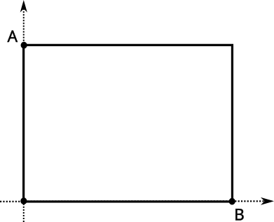
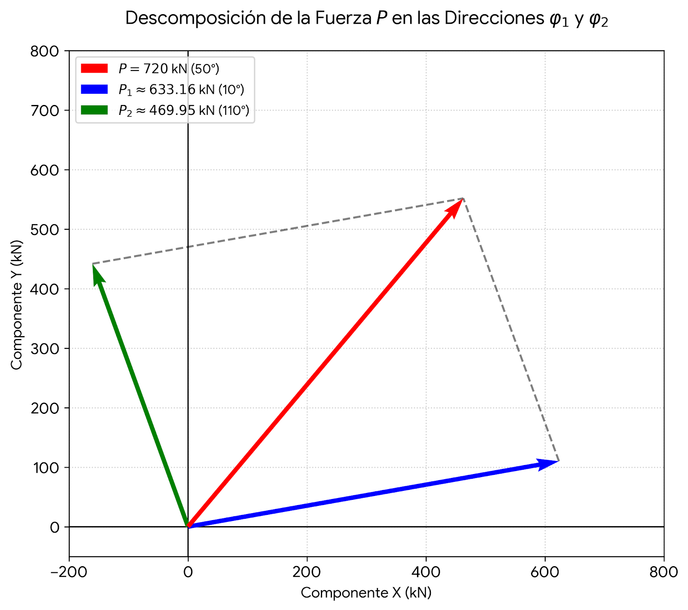
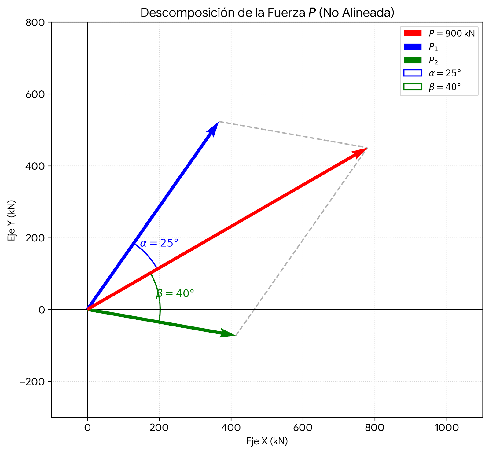

\begin{center}
\large\textbf{Estabilidad / Estática y Resistencia de Materiales}\\
\normalsize UT1 — Semana 1 \quad|\quad Fuerzas Concurrentes en el Plano
\end{center}

\vspace{0.3cm}
\hrule
\vspace{0.4cm}

---

## Parte 1 — Representación y componentes

**Ejercicio 1**

Las siguientes fuerzas actúan sobre estructuras. Para cada una, indicar el cuadrante, calcular las componentes cartesianas y verificar el resultado reconstruyendo el módulo.

| Fuerza | $P$ (kN) | $\varphi$ |
|--------|---------|-----------|
| $P_1$  | 420     | 35°       |
| $P_2$  | 650     | 128°      |
| $P_3$  | 310     | 243°      |
| $P_4$  | 780     | 317°      |
| $P_5$  | 500     | 90°       |
| $P_6$  | 290     | 180°      |

---

**Ejercicio 2**

Dadas las siguientes componentes, determinar módulo y argumento $\varphi$ de cada fuerza. Indicar cuadrante y representar gráficamente.

a) $P_x = +380\,\text{kN}$, $\quad P_y = +380\,\text{kN}$

b) $P_x = -520\,\text{kN}$, $\quad P_y = +300\,\text{kN}$

c) $P_x = -410\,\text{kN}$, $\quad P_y = -410\,\text{kN}$

d) $P_x = +630\,\text{kN}$, $\quad P_y = -220\,\text{kN}$

e) $P_x = 0\,\text{kN}$,     $\quad P_y = -740\,\text{kN}$

---

## Parte 2 — Momento estático

**Ejercicio 3**

Una fuerza $P = 600\,\text{kN}$ con argumento $\varphi = 40°$ está aplicada en el punto $A = (2{,}0;\; 1{,}0)\,\text{m}$.

a) Calcular el momento respecto al origen $O = (0;\,0)$.

b) Calcular el momento respecto al punto $C = (5{,}0;\; 3{,}5)\,\text{m}$.

c) ¿En qué punto sobre el eje $x$ el momento de $P$ es nulo? Justificar.

---

**Ejercicio 4**

Aplicar el **Teorema de Varignon** para calcular el momento de la fuerza $P = 850\,\text{kN}$ a $\varphi = 55°$, aplicada en $A = (1{,}5;\; 0{,}5)\,\text{m}$, respecto al punto $O = (4{,}0;\; 3{,}0)\,\text{m}$.

a) Calcular directamente: $M = P \times d$ (hallar $d$ geométricamente).

b) Calcular por Varignon: $M = P_x \cdot |y_O - y_A| - P_y \cdot |x_O - x_A|$.

c) Verificar que ambos resultados coinciden.

---

**Ejercicio 5**

Dos fuerzas actúan sobre un marco rigido:

- $P_1 = 400\,\text{kN}$ a $\varphi_1 = 0°$, aplicada en $A_1 = (0;\; 2{,}0)\,\text{m}$
- $P_2 = 300\,\text{kN}$ a $\varphi_2 = 270°$, aplicada en $A_2 = (3{,}0;\; 0)\,\text{m}$

Calcular el momento de cada fuerza respecto al punto $O = (0;\; 0)$.
¿Cuál tiende a hacer girar la estructura en sentido horario?

---

## Parte 3 — Pares de fuerzas

**Ejercicio 6**

Un par de fuerzas actúa sobre una placa rígida.
Las fuerzas tienen intensidad $P = 250\,\text{kN}$ y sus rectas de acción
están separadas $d = 1{,}8\,\text{m}$.

a) Calcular el momento del par.

b) Si se desea mantener el mismo momento pero con $P' = 400\,\text{kN}$, ¿cuál debe ser la nueva separación $d'$?

c) ¿Cambia el efecto del par si se traslada a otra posición de la placa? Justificar con las propiedades del par.

---

**Ejercicio 7**

Identificar cuáles de los siguientes sistemas constituyen un par de fuerzas y calcular su momento. Indicar signo según la convención antihoraria positiva.

a) $P_1 = 180\,\text{kN}$ ↑ en $x = 0$; $\quad P_2 = 180\,\text{kN}$ ↓ en $x = 2{,}5\,\text{m}$

b) $P_1 = 180\,\text{kN}$ ↑ en $x = 0$; $\quad P_2 = 180\,\text{kN}$ ↑ en $x = 2{,}5\,\text{m}$

c) $P_1 = 200\,\text{kN}$ → en $y = 1{,}0$; $\quad P_2 = 200\,\text{kN}$ ← en $y = 3{,}5\,\text{m}$

d) $P_1 = 200\,\text{kN}$ → en $y = 1{,}0$; $\quad P_2 = 150\,\text{kN}$ ← en $y = 3{,}5\,\text{m}$

---

## Parte 4 — Composición de fuerzas concurrentes

**Ejercicio 8**

En el siguiente sistema de fuerzas:

| Fuerza | $P$ (kN) | $\varphi$ |
|--------|---------|-----------|
| $P_1$  | 480     | 0°        |
| $P_2$  | 360     | 75°       |
| $P_3$  | 520     | 195°      |
| $P_4$  | 290     | 290°      |

a) Calcular la resultante por el método analítico (dos ecuaciones de proyección).

b) Verificar trazando el polígono de fuerzas gráficamente con escala libre.

c) Indicar en qué cuadrante se ubica la resultante y qué significa físicamente para el nudo.

---

**Ejercicio 9**

Tres cables se anclan en un punto $O$ de una estructura de soporte.
Las tensiones en los cables son:

- $T_1 = 550\,\text{kN}$ a $\varphi_1 = 30°$
- $T_2 = 420\,\text{kN}$ a $\varphi_2 = 150°$
- $T_3 = 380\,\text{kN}$ a $\varphi_3 = 270°$

a) Calcular la resultante $R$ por dos ecuaciones de momento.

b) Recalcular usando una ecuación de proyección y una de momentos respecto a $O = (2{,}0;\; 1{,}5)\,\text{m}$. Verificar que coincide.

c) ¿El sistema está en equilibrio? ¿Qué fuerza habría que agregar para lograrlo?

---

## Parte 5 — Descomposición de fuerzas

**Ejercicio 10**

Una fuerza $P = 720\,\text{kN}$ a $\varphi = 50°$ debe descomponerse en dos direcciones concurrentes: $\varphi_1 = 10°$ y $\varphi_2 = 110°$.

a) Resolver analíticamente por dos ecuaciones de proyección. Hallar $P_1$ y $P_2$.

b) Verificar que $P_1$ y $P_2$ tienen como resultante el vector $P$ original.

---

**Ejercicio 11**

Una fuerza $P = 900\,\text{kN}$ debe descomponerse en dos direcciones oblicuas que forman ángulos $\alpha = 25°$ y $\beta = 40°$ con $P$.

a) Aplicar la regla del seno para hallar las componentes $P_1$ y $P_2$.

b) ¿Por qué no se puede usar Pitágoras en este caso?

c) ¿Qué ocurre si $\alpha + \beta = 90°$? Demostrar que la regla del seno
se reduce al caso cartesiano.

---

## Parte 6 — Terna local y rotación de ejes

**Ejercicio 12**

Una barra de una cercha metálica forma un ángulo $\theta = 40°$ con la horizontal.
La terna local $(x', y')$ está alineada con la barra.

Una fuerza en la terna global tiene componentes:
$P_x = 500\,\text{kN}$, $\quad P_y = -300\,\text{kN}$.

a) Calcular las componentes en la terna local $(P_{x'}, P_{y'})$.

b) Verificar que el módulo se conserva: $|P'| = |P|$.

c) Interpretar físicamente: ¿cuál componente produce esfuerzo axial en la barra? ¿Cuál produce esfuerzo de corte?

---

**Ejercicio 13**

Una fuerza $P = 650\,\text{kN}$ a $\varphi = 70°$ (terna global) actúa sobre
una barra inclinada $\theta = 30°$.

a) Calcular las componentes en la terna local.

b) Repetir para $\theta = 70°$. ¿Qué componente de corte se obtiene?
¿Tiene sentido físico ese resultado?

---

## Parte 7 — Equilibrio

**Ejercicio 14**

Cuatro fuerzas actúan sobre un nudo. Tres son conocidas:

- $P_1 = 600\,\text{kN}$ a $\varphi_1 = 0°$
- $P_2 = 450\,\text{kN}$ a $\varphi_2 = 90°$
- $P_3 = 380\,\text{kN}$ a $\varphi_3 = 210°$

Determinar módulo y argumento de la fuerza $P_4$ que pone el sistema en equilibrio.

---

**Ejercicio 15**

Un poste esta sometido a tres fuerzas en su punto superior:

- Tensión del cable izquierdo: $T_1 = 480\,\text{kN}$ a $\varphi_1 = 145°$
- Tensión del cable derecho: $T_2 = 480\,\text{kN}$ a $\varphi_2 = 35°$
- Peso propio del soporte: $W = 120\,\text{kN}$ a $\varphi_3 = 270°$

a) Calcular la resultante sobre el punto de anclaje.

b) ¿El sistema está en equilibrio? Si no lo está, ¿qué fuerza ejerce la estructura del poste para mantener el equilibrio?

c) ¿Cómo cambia la resultante si $T_1 = T_2$ y el ángulo de ambos cables con la horizontal disminuye de $35°$ a $20°$? Discutir la implicancia para el diseño del poste.

---

\vspace{0.5cm}
\hrule
\vspace{0.3cm}

\begin{center}
\textit{Todos los ejercicios deben presentar: planteo, desarrollo, resultado y verificación.}
\end{center}