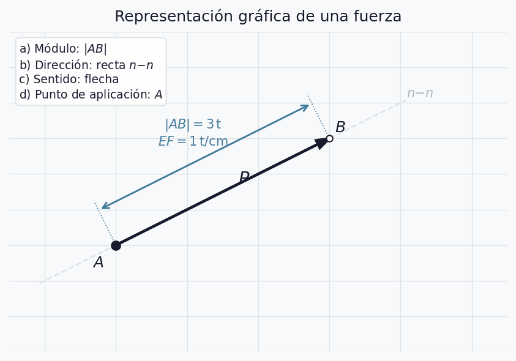
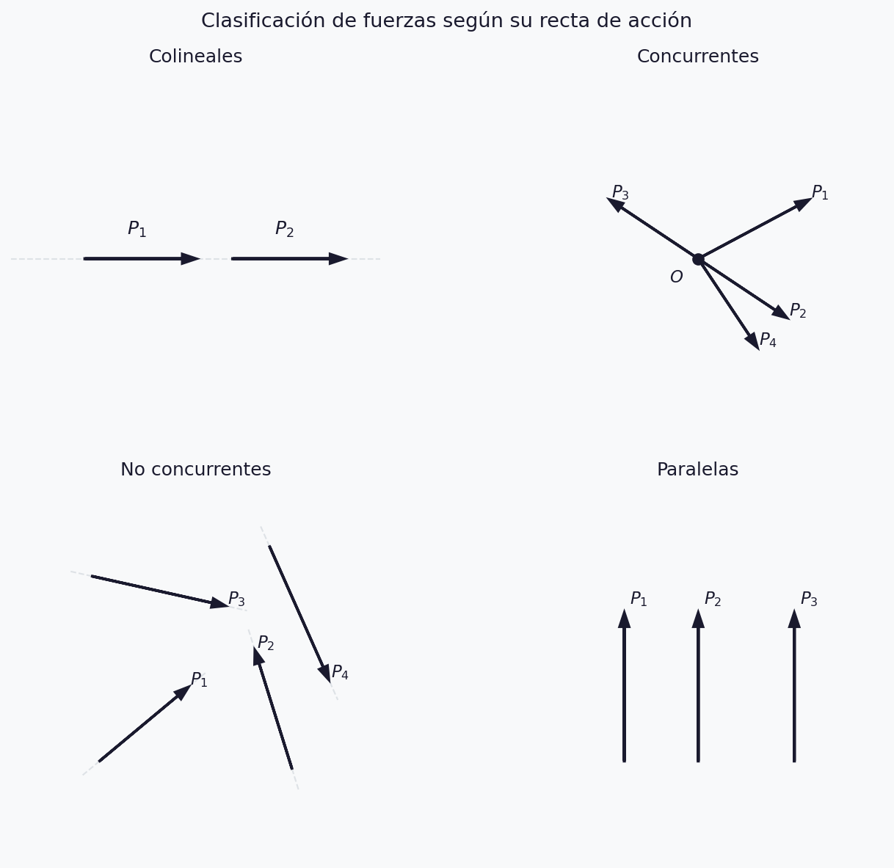
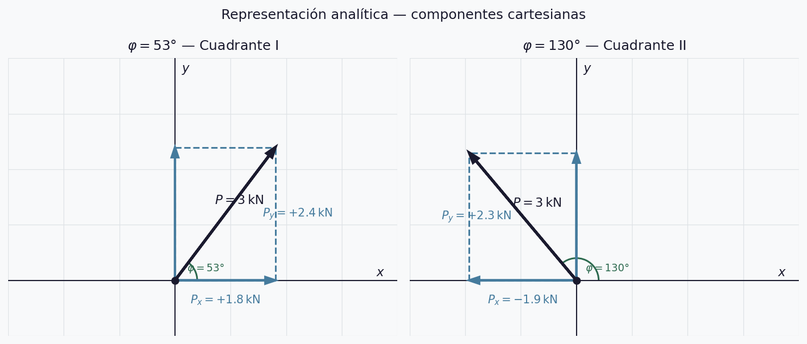
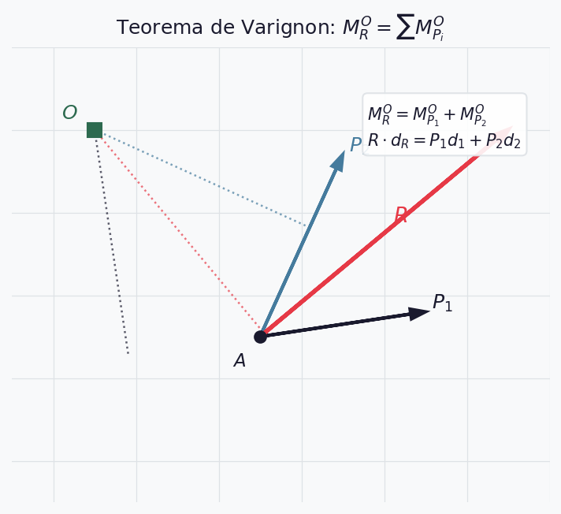
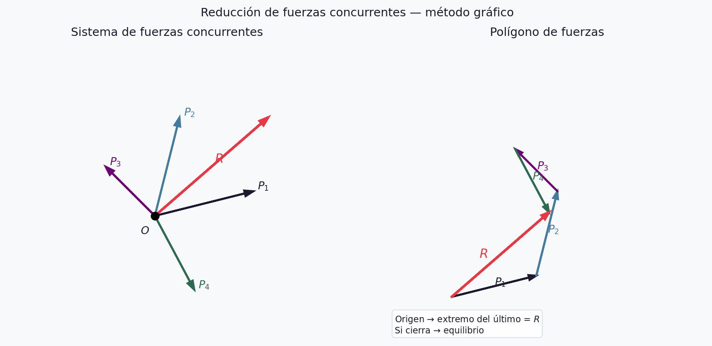
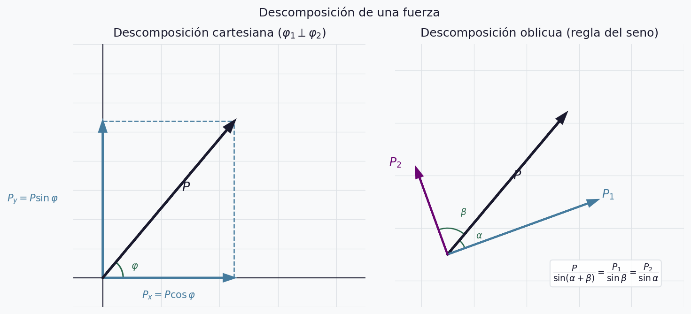
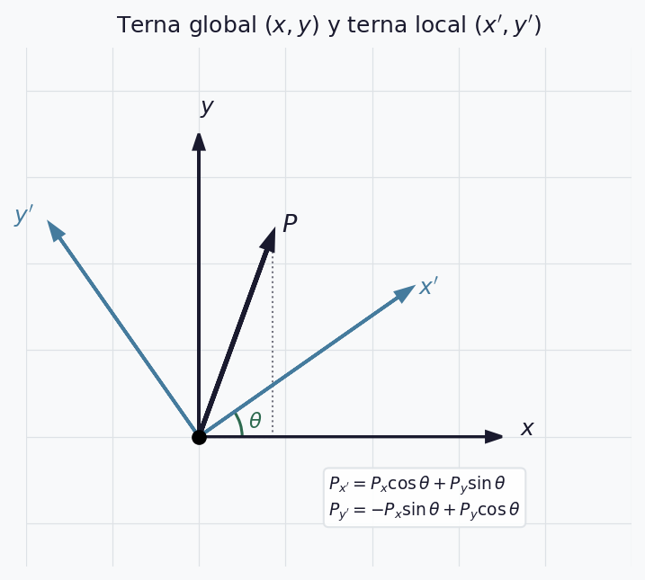
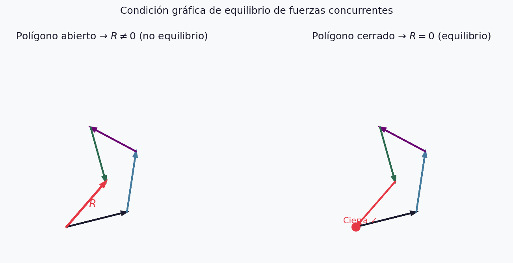

## ¿Qué estudia la Estática?

> La Estática estudia las condiciones que deben cumplir las fuerzas que actúan
> sobre un sistema para que éste permanezca en **estado de equilibrio**.

. . .

Dos problemas centrales en todo sistema de fuerzas:

- **Reducción** — reemplazar el sistema por otro equivalente con el menor número de elementos
- **Equilibrio** — determinar las condiciones para que la resultante sea nula

---

## Hipótesis de rigidez

El cuerpo rígido es un modelo ideal: bajo la acción de las fuerzas, la distancia
y posición relativa entre las partículas que lo constituyen permanece invariable.

. . .

Consecuencias:
- Una fuerza puede **desplazarse sobre su recta de acción** sin alterar su efecto
- Válido para cuerpos con **pequeñas deformaciones**

::: {.callout-note}
Este modelo es la base de toda la UT1. En UT6 lo reemplazaremos por el cuerpo deformable.
:::

---

## Las cuatro características de una fuerza

:::: {.columns}
::: {.column width="45%"}
| # | Característica | Descripción |
|---|---|---|
| a | **Módulo** | Intensidad según $EF$ |
| b | **Dirección** | Recta de acción |
| c | **Sentido** | Flecha |
| d | **Punto de aplicación** | Letra $A$ |
:::
::: {.column width="55%"}
{width=100%}
:::
::::

::: {.callout-warning}
Dar solo la magnitud es una descripción **incompleta**.
:::

---

## Escala de fuerzas

$$EF = \frac{\text{fuerza (kN o t)}}{\text{longitud (cm)}}$$

**Ejemplo:** $EF = 200\,\text{kN/cm}$, $P = 800\,\text{kN}$

$$x = \frac{800}{200} = 4\,\text{cm}$$

::: {.callout-warning}
La $EF$ es independiente de la escala geométrica del dibujo.
:::

---

## Clasificación según la recta de acción

{width=80% fig-align="center"}

---

## Principios fundamentales de la Estática

::: {.incremental}
a. **Paralelogramo:** el efecto de dos fuerzas concurrentes es equivalente al de su resultante
b. **Deslizamiento:** una fuerza puede desplazarse sobre su recta de acción sin alterar su efecto
c. **Sistema nulo:** dos fuerzas iguales y de sentido contrario en la misma recta se equilibran
d. **Adición de sistema nulo:** agregar o suprimir un sistema nulo no altera el equilibrio
e. **Resultante única:** un sistema de fuerzas admite una única resultante
f. **Descomposición:** una fuerza puede reemplazarse por componentes
g. **Acción y reacción:** fuerzas de acción y reacción son iguales, colineales y opuestas
:::

---

## Representación analítica — argumento $\varphi$

$$\boxed{P_x = P\cos\varphi} \qquad \boxed{P_y = P\sin\varphi}$$

$$|P| = \sqrt{P_x^2 + P_y^2} \qquad \tan\varphi = \frac{P_y}{P_x}$$

---

## Cuadrantes — argumento $\varphi$

. . .

| Cuadrante | $\varphi$ | $P_x$ | $P_y$ |
|---|---|---|---|
| I ↗ | $0°$–$90°$ | $+$ | $+$ |
| II ↖ | $90°$–$180°$ | $-$ | $+$ |
| III ↙ | $180°$–$270°$ | $-$ | $-$ |
| IV ↘ | $270°$–$360°$ | $+$ | $-$ |

---

## Componentes cartesianas — ejemplos

{width=85% fig-align="center"}

::: {.callout-warning}
Siempre dibujar los ejes y marcar $\varphi$ antes de calcular.
El $\arctan$ devuelve valores en $(-90°,\,90°)$ — verificar cuadrante por signo de $P_x$ y $P_y$.
:::

---

## Momento estático de una fuerza

$$M = P \times d \quad [\text{kN·m}]$$

$d$ = distancia normal entre $O$ y la recta de acción (**brazo de palanca**)

Positivo cuando tiende a girar en sentido **antihorario** $(+\circlearrowleft)$

. . .

$$M = 2 \times \text{Área}(\triangle OAB)$$

---

## Momento estático — diagrama

{width=45% fig-align="center"}

::: {.callout-note}
El brazo $d$ es siempre la distancia **perpendicular** entre $O$ y la recta de acción,
no la distancia entre $O$ y el punto de aplicación $A$.
:::

---

## Teorema de Varignon

$$M_R^O = \sum M_{P_i}^O \qquad R \cdot d_R = P_1 d_1 + P_2 d_2$$

. . .

{width=65% fig-align="center"}

---

## Pares de fuerzas

$$M_{par} = P \times d$$

::: {.incremental}
- Resultante **nula** → no produce traslación, solo rotación
- **Libre**: puede trasladarse y girar en el plano
- $M = P_1 d_1 = P_2 d_2$ — invariante
- $M_R = \sum M_i$
:::

---

## Par de fuerzas — diagrama

{width=80% fig-align="center"}

---

## Traslación de fuerzas

Para trasladar $P$ del punto $A$ al punto $B$:

$$P \text{ en } A \equiv P' \text{ en } B + \text{par } M = P \cdot d$$

. . .

{width=85% fig-align="center"}

---

## Reducción de fuerzas concurrentes — gráfico

{width=80% fig-align="center"}

::: {.callout-note}
Si el polígono **cierra** → resultante nula → sistema en **equilibrio**
:::

---

## Reducción de fuerzas concurrentes — analítico

**a) Dos ecuaciones de proyección** *(más usada)*

$$R_x = \sum P_i \cos\varphi_i \qquad R_y = \sum P_i \sin\varphi_i$$

$$|R| = \sqrt{R_x^2 + R_y^2} \qquad \tan\varphi_R = \frac{R_y}{R_x}$$

. . .

**b) Una proyección + un momento**

$$R_x = \sum P_i \cos\varphi_i \qquad M_R^O = \sum M_i^O$$

. . .

**c) Dos momentos** respecto a puntos no alineados con la concurrencia

---

## Descomposición de fuerzas

{width=80% fig-align="center"}

::: {.callout-warning}
Descomposición en **3 o más** direcciones concurrentes → sistema **indeterminado**.
:::

---

## Terna global vs. terna local

$$P_{x'} = P_x\cos\theta + P_y\sin\theta \qquad P_{y'} = -P_x\sin\theta + P_y\cos\theta$$

. . .

{width=60% fig-align="center"}

::: {.callout-note}
El módulo de la fuerza **no cambia** al rotar la terna.
:::

---

## Equilibrio de fuerzas concurrentes

**Condición gráfica:** el polígono de fuerzas debe ser **cerrado**

{width=75% fig-align="center"}

**Condición analítica:**
$$\sum P_i \cos\varphi_i = 0 \qquad \sum P_i \sin\varphi_i = 0$$
