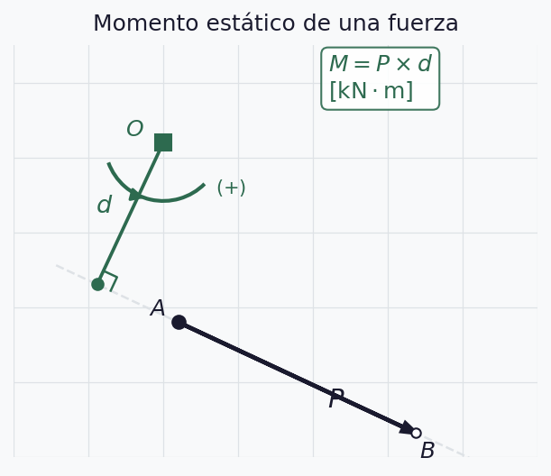
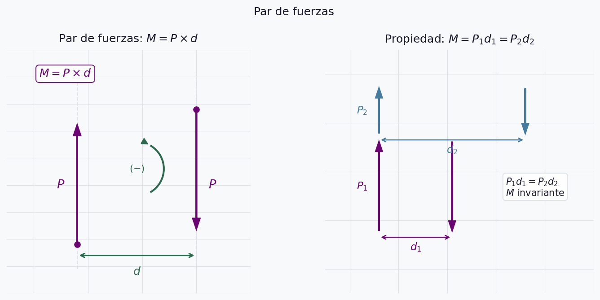
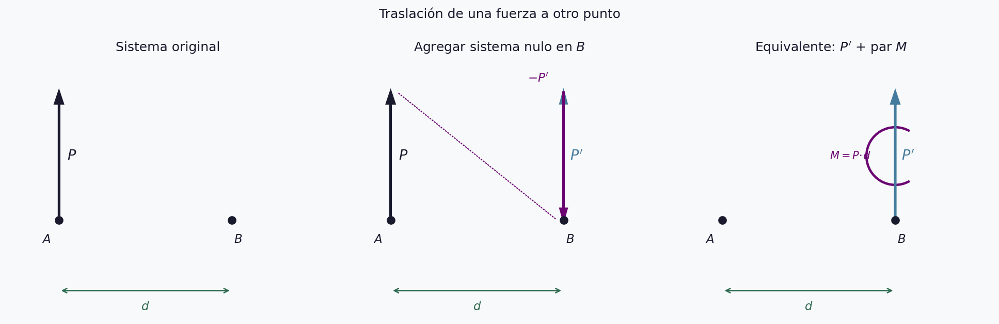
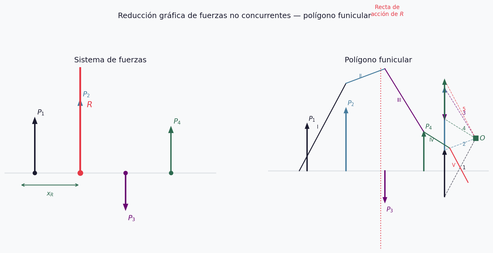
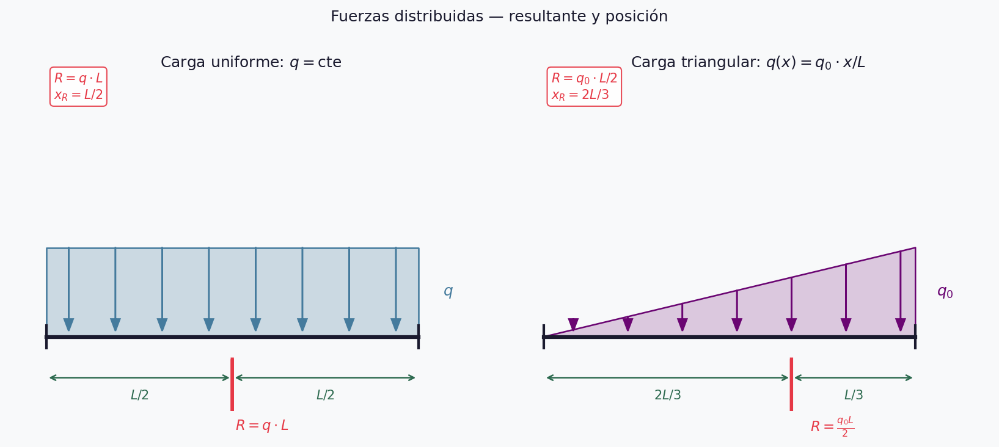

## Repaso Semana 1

::: {.incremental}
- Fuerzas concurrentes: 4 características, argumento $\varphi$
- Componentes: $P_x = P\cos\varphi$, $P_y = P\sin\varphi$
- Composición analítica: $R_x = \sum P_i\cos\varphi_i$, $R_y = \sum P_i\sin\varphi_i$
- Descomposición: cartesiana y oblicua (regla del seno)
- Equilibrio: $\sum P_x = 0$, $\sum P_y = 0$
:::

::: {.notes}
Preguntar: ¿cuántas ecuaciones necesitaban para definir la resultante de fuerzas concurrentes?
La respuesta es 2. Hoy van a ver por qué para no concurrentes necesitamos 3.
:::

---

## ¿Qué cambia hoy?

Para fuerzas **concurrentes**: la resultante pasa por el punto de concurrencia → 2 ecuaciones alcanzan.

. . .

Para fuerzas **no concurrentes**: la recta de acción de la resultante es desconocida → necesitamos **3 ecuaciones**.

. . .

$$R_x = \sum P_i\cos\varphi_i \qquad R_y = \sum P_i\sin\varphi_i \qquad M_R^O = \sum M_i^O$$

::: {.notes}
La tercera ecuación (momento) es la que ubica la recta de acción.
Sin ella sabemos módulo y dirección de R, pero no dónde está.
:::

---

## Momento estático — definición

$$\boxed{M = P \times d} \quad [\text{kN·m}]$$

- $d$: distancia **perpendicular** entre $O$ y la recta de acción
- Positivo si gira en sentido **antihorario** $(+\circlearrowleft)$

::: {.notes}
Insistir: d no es la distancia de O a A, sino la distancia perpendicular a la recta de acción.
Error muy frecuente en los primeros ejercicios.
:::

---

## Momento estático — diagrama

{style="width:100%; height:78vh; object-fit:contain;"}

::: {.notes}
Señalar el ángulo recto en el pie de la perpendicular.
Mostrar que si O estuviera sobre la recta de acción, d=0 y M=0.
:::

---

## Momento estático — expresión analítica

Dada la fuerza $P$ aplicada en $(x_i,\,y_i)$ y centro de momentos $O = (x_O,\,y_O)$:

$$M^O = P_x \cdot |y_O - y_i| - P_y \cdot |x_O - x_i|$$

. . .

**Ejemplo:** $P = 600\,\text{kN}$ a $\varphi = 40°$, $A = (2{,}0;\;1{,}0)$, $O = (0;\;0)$

$$P_x = 459{,}6\,\text{kN} \qquad P_y = 385{,}7\,\text{kN}$$

$$M^O = 459{,}6 \times 1{,}0 - 385{,}7 \times 2{,}0 = -311{,}8\,\text{kN·m}$$

::: {.notes}
El signo negativo indica sentido horario.
Preguntar a los alumnos: ¿qué sentido tiene físicamente ese momento?
:::

---

## Teorema de Varignon

> El momento de la resultante respecto a un punto es igual a la
> **suma algebraica** de los momentos de las componentes.

$$M_R^O = \sum M_{P_i}^O \qquad R \cdot d_R = P_1 d_1 + P_2 d_2$$

::: {.notes}
Varignon es la base del cálculo analítico de momentos.
Permite reemplazar el cálculo geométrico del brazo d
por la suma de dos productos con las componentes cartesianas.
:::

---

## Teorema de Varignon — diagrama

{style="width:100%; height:78vh; object-fit:contain;"}

::: {.notes}
Mostrar que los brazos d1 y d2 son fáciles de calcular como diferencias de coordenadas,
mientras que dR requeriría geometría más compleja.
:::

---

## Par de fuerzas — definición

Dos fuerzas de **igual intensidad**, **sentidos contrarios** y **rectas de acción paralelas**:

$$M_{par} = P \times d$$

. . .

La resultante de un par es **nula** → no produce traslación, solo rotación.

::: {.notes}
Preguntar: si la resultante es nula, ¿está el sistema en equilibrio?
No necesariamente — el par produce rotación aunque no haya traslación.
:::

---

## Par de fuerzas — propiedades

::: {.incremental}
- Es **libre**: puede trasladarse y girar en el plano manteniendo $M$
- $M = P_1 d_1 = P_2 d_2$ — el momento es **invariante**
- Para sumar pares: $M_R = \sum M_i$
- Dos pares son iguales si tienen **igual momento**
:::

::: {.notes}
La libertad del par es fundamental para la traslación de fuerzas que viene después.
Dar un ejemplo concreto: el par que produce el volante de una máquina
puede representarse en cualquier punto del plano.
:::

---

## Par de fuerzas — diagrama

{style="width:100%; height:78vh; object-fit:contain;"}

::: {.notes}
Señalar en el panel derecho que aunque P2 < P1, el momento es el mismo
porque d2 > d1 en proporción inversa.
:::

---

## Traslación de fuerzas

Para trasladar $P$ de $A$ a $B$ (cambia su recta de acción):

::: {.incremental}
1. Agregar en $B$ un **sistema nulo**: $P'$ y $-P'$ paralelas a $P$
2. $P$ en $A$ y $-P'$ en $B$ forman un **par** $M = P \cdot d$
3. Sistema equivalente: $P'$ en $B$ + par $M$
:::

$$\boxed{d = \frac{M}{P}}$$

::: {.notes}
Enfatizar que el sistema nulo no altera el efecto (principio d).
Este resultado es la base para reducir sistemas no concurrentes.
:::

---

## Traslación de fuerzas — diagrama

{style="width:100%; height:78vh; object-fit:contain;"}

::: {.notes}
Recorrer los tres paneles de izquierda a derecha.
Preguntar: ¿qué pasaría si d=0? El par sería nulo y la fuerza se traslada sin efecto adicional,
lo que confirma el principio de deslizamiento sobre la recta de acción.
:::

---

## Reducción no concurrente — método analítico (1/3)

**a) Dos proyecciones + un momento** *(más usada)*

$$R_x = \sum P_i\cos\varphi_i \qquad R_y = \sum P_i\sin\varphi_i$$

$$M_R^O = \sum M_i^O$$

La tercera ecuación fija un punto de la recta de acción de $R$:

$$x_R = \frac{M_R^O}{R_y} \quad \text{(si } R_y \neq 0\text{)} \qquad y_R = \frac{M_R^O}{R_x} \quad \text{(si } R_x \neq 0\text{)}$$

::: {.notes}
Aclarar que se elige xR o yR según cuál componente sea no nula.
Si ambas son no nulas, cualquiera de las dos determina la recta de acción.
:::

---

## Reducción no concurrente — método analítico (2/3)

**b) Una proyección + dos momentos**

$$R_x = \sum P_i\cos\varphi_i$$

$$M_R^O = \sum M_i^O \qquad M_R^N = \sum M_i^N$$

::: {.callout-warning}
Los centros $O$ y $N$ no pueden estar sobre una recta perpendicular al eje de proyección elegido.
:::

::: {.notes}
Si la condición no se cumple, el sistema es indeterminado porque
las dos ecuaciones de momento dan la misma información.
:::

---

## Reducción no concurrente — método analítico (3/3)

**c) Tres momentos** respecto a tres puntos no alineados

$$M_R^O = \sum M_i^O \qquad M_R^N = \sum M_i^N \qquad M_R^S = \sum M_i^S$$

::: {.callout-warning}
Los puntos $O$, $N$ y $S$ no deben estar alineados.
:::

. . .

Los tres métodos son equivalentes. En la práctica se usa **a)** por ser el más directo.

::: {.notes}
El método c) tiene valor teórico y aparece en verificaciones.
Para resolver problemas, siempre recomendar el método a).
:::

---

## Ejemplo — composición no concurrente

Dos fuerzas sobre una viga de $4\,\text{m}$:

- $P_1 = 400\,\text{kN}$ ↑ en $x = 0$
- $P_2 = 300\,\text{kN}$ ↑ en $x = 4\,\text{m}$

. . .

**Paso 1 — resultante:**
$$R = 400 + 300 = 700\,\text{kN} \uparrow \qquad \varphi_R = 90°$$

. . .

**Paso 2 — recta de acción** (momento respecto a $O = (0;\;0)$):
$$M_R^O = 400 \times 0 + 300 \times 4 = 1200\,\text{kN·m}$$
$$x_R = \frac{1200}{700} = 1{,}71\,\text{m}$$

::: {.notes}
Preguntar antes de resolver: ¿dónde esperan que caiga la resultante?
Entre 0 y 4m, más cerca de P2 porque es menor... ¿o más cerca de P1?
La resultante se acerca a la fuerza mayor.
:::

---

## Polígono funicular — construcción (1/2)

Para fuerzas no concurrentes, el polígono de fuerzas da módulo y dirección de $R$
pero **no su recta de acción**. El polígono funicular la ubica.

. . .

Pasos:

::: {.incremental}
1. Trazar el **polígono de fuerzas** con escala $EF$
2. Elegir un **polo** $O$ arbitrario
3. Trazar los **rayos polares** de $O$ a cada vértice del polígono
:::

::: {.notes}
El polo O puede elegirse en cualquier lugar. Su posición afecta la forma del funicular
pero no el resultado final (la recta de acción de R).
:::

---

## Polígono funicular — construcción (2/2)

::: {.incremental}
4. Trazar los **lados del funicular** paralelos a cada rayo polar,
   comenzando por un punto arbitrario sobre $P_1$
5. Cada lado se extiende hasta la recta de acción de la fuerza siguiente
6. Prolongar el **primer y último lado** hasta que se corten
7. Por ese punto pasa la **recta de acción** de $R$
:::

::: {.notes}
Insistir: cada lado del funicular es paralelo al rayo polar correspondiente.
El punto de cruce del primer y último lado es la clave — ahí pasa R.
:::

---

## Polígono funicular — diagrama

{style="width:100%; height:78vh; object-fit:contain;"}

::: {.notes}
Señalar: polígono de fuerzas a la derecha, polo O, rayos polares punteados,
lados del funicular sobre el sistema de fuerzas, intersección marcada con estrella.
:::

---

## Casos del polígono funicular

| Polígono de fuerzas | 1° y último lado del funicular | Resultado |
|---|---|---|
| Abierto | Se cortan en un punto | Resultante única |
| Cerrado | Paralelos | Sistema reduce a un **par** |
| Cerrado | Coinciden | **Equilibrio** |

::: {.notes}
Este cuadro es uno de los más importantes del curso.
Pedir a los alumnos que lo copien y lo recuerden para el parcial.
:::

---

## Fuerzas paralelas

Caso particular de no concurrentes: todas las rectas de acción son paralelas.

$$R = \sum P_i \qquad x_R = \frac{\sum P_i \cdot x_i}{R}$$

. . .

**Ejemplo:** $P_1 = 200\,\text{kN}$ en $x=0$; $P_2 = 350\,\text{kN}$ en $x=3\,\text{m}$; $P_3 = 150\,\text{kN}$ en $x=7\,\text{m}$

$$R = 700\,\text{kN} \qquad x_R = \frac{0 + 1050 + 1050}{700} = 3{,}0\,\text{m}$$

::: {.notes}
Verificar que xR está entre 0 y 7m. Si cae fuera de ese rango hay un error.
Notar que xR = 3m coincide con la posición de P2 — es una coincidencia numérica en este ejemplo.
:::

---

## Fuerzas distribuidas — concepto

Una carga distribuida $q(x)$ [\text{kN/m}] se reemplaza por su resultante puntual:

$$R = \int_0^L q(x)\,dx \qquad x_R = \frac{\int_0^L x\,q(x)\,dx}{R}$$

::: {.notes}
Aclarar que q(x) es una densidad de fuerza por unidad de longitud.
En estructuras aparece como peso propio, presión del viento, carga de nieve, etc.
:::

---

## Carga uniforme

$$q(x) = q = \text{cte}$$

$$R = q \cdot L \qquad x_R = \frac{L}{2}$$

La resultante actúa en el **centro del tramo**.

::: {.notes}
Caso más frecuente en vigas. El peso propio de una viga uniforme
es una carga distribuida uniforme.
:::

---

## Carga triangular

$$q(x) = q_0 \cdot \frac{x}{L}$$

$$R = \frac{q_0 \cdot L}{2} \qquad x_R = \frac{2L}{3}$$

La resultante actúa a **dos tercios** del extremo de menor carga.

::: {.notes}
Pedir que deduzcan xR = 2L/3 integrando x·q(x) antes de mostrarlo.
Este resultado aparece en vigas con presión hidrostática o viento variable.
:::

---

## Fuerzas distribuidas — diagrama

{style="width:100%; height:78vh; object-fit:contain;"}

::: {.notes}
Señalar en cada panel la forma del diagrama de carga,
la posición de la resultante y las cotas de L/2 y 2L/3.
:::

---

## Equilibrio — condición analítica (1/2)

**a) Dos proyecciones + un momento:**

$$\sum P_i\cos\varphi_i = 0 \qquad \sum P_i\sin\varphi_i = 0 \qquad \sum M_i^O = 0$$

. . .

**b) Una proyección + dos momentos:**

$$\sum P_i\cos\varphi_i = 0 \qquad \sum M_i^O = 0 \qquad \sum M_i^N = 0$$

::: {.notes}
En los problemas de equilibrio de vigas (Semana 7-8) se usará casi siempre la forma a).
Conviene elegir O en el punto de aplicación de una reacción desconocida para eliminarla.
:::

---

## Equilibrio — condición analítica (2/2)

**c) Tres momentos** respecto a puntos no alineados:

$$\sum M_i^O = 0 \qquad \sum M_i^N = 0 \qquad \sum M_i^S = 0$$

::: {.callout-warning}
En todos los casos, los centros de momentos no deben estar alineados
entre sí ni con la dirección de las fuerzas.
:::

::: {.notes}
Si los puntos están alineados, dos de las tres ecuaciones son linealmente dependientes
y el sistema queda indeterminado.
:::

---

## Práctica — Parte 1 (25 min)

**Problema 1 ★☆☆**

$P = 550\,\text{kN}$ a $\varphi = 35°$, aplicada en $A = (2{,}0;\;1{,}5)\,\text{m}$.

a) Calcular $M$ respecto a $O_1 = (0;\;0)$ y $O_2 = (5{,}0;\;3{,}0)\,\text{m}$
b) Verificar por Varignon en ambos casos

. . .

**Problema 2 ★★☆**

Tres fuerzas verticales sobre una viga:
$P_1 = 180\,\text{kN}$ en $x=0$; $P_2 = 260\,\text{kN}$ en $x=3\,\text{m}$; $P_3 = 140\,\text{kN}$ en $x=7\,\text{m}$

Determinar resultante y posición de su recta de acción.

::: {.notes}
Circular por los bancos durante los primeros 5 min.
El error más frecuente en P1 es olvidar el signo de Py al aplicar Varignon.
:::

---

## Práctica — Parte 2 (25 min)

**Problema 3 ★★☆**

Viga de $8\,\text{m}$: carga uniforme $q = 25\,\text{kN/m}$ en los primeros $5\,\text{m}$
y carga triangular $q_0 = 40\,\text{kN/m}$ en los $3\,\text{m}$ restantes.

Calcular resultante total y posición.

. . .

**Problema 4 ★★★**

Cuatro fuerzas sobre una placa:
$P_1 = 300\,\text{kN}$ a $0°$ en $(0;\;2{,}0)$;
$P_2 = 400\,\text{kN}$ a $90°$ en $(3{,}0;\;0)$;
$P_3 = 300\,\text{kN}$ a $180°$ en $(6{,}0;\;2{,}0)$;
$P_4 = 400\,\text{kN}$ a $270°$ en $(3{,}0;\;4{,}0)$

¿El sistema está en equilibrio? Verificar por los tres métodos.

::: {.notes}
P4 tiene simetría — anticipar que puede estar en equilibrio.
Pedir que no anticipen la respuesta y que hagan el cálculo completo.
:::

---

## Solución — Parte 1

**Problema 1:**
$$P_x = 450{,}4\,\text{kN} \qquad P_y = 315{,}4\,\text{kN}$$
$$M^{O_1} = 450{,}4 \times 1{,}5 - 315{,}4 \times 2{,}0 = +44{,}8\,\text{kN·m}$$
$$M^{O_2} = 450{,}4 \times |3{,}0-1{,}5| - 315{,}4 \times |5{,}0-2{,}0| = -270{,}6\,\text{kN·m}$$

. . .

**Problema 2:**
$$R = 580\,\text{kN} \uparrow \qquad x_R = \frac{0 + 780 + 980}{580} = 3{,}03\,\text{m}$$

::: {.notes}
En P1 señalar que el cambio de signo entre O1 y O2 tiene sentido físico:
desde un lado la fuerza gira antihorario, desde el otro gira horario.
:::

---

## Solución — Parte 2

**Problema 3:**

$R_1 = 25 \times 5 = 125\,\text{kN}$ en $x_1 = 2{,}5\,\text{m}$

$R_2 = \frac{40 \times 3}{2} = 60\,\text{kN}$ en $x_2 = 5 + \frac{2 \times 3}{3} = 7{,}0\,\text{m}$

$$R = 185\,\text{kN} \qquad x_R = \frac{125 \times 2{,}5 + 60 \times 7{,}0}{185} = 3{,}96\,\text{m}$$

. . .

**Problema 4:**
$$R_x = 300 - 300 = 0 \qquad R_y = 400 - 400 = 0$$
$$M^O = 300\times2 - 400\times3 - 300\times2 + 400\times3 = 0$$

Sistema en **equilibrio** ✓

::: {.notes}
En P4 señalar que la verificación por los tres métodos da siempre cero
porque el sistema es simétrico. Vale la pena mostrarlo para el método c).
:::

---

## Síntesis

::: {.incremental}
- Para no concurrentes se necesitan **3 ecuaciones** — la tercera ubica la recta de acción de $R$
- **Varignon**: $M_R^O = \sum M_i^O$ — simplifica el cálculo del brazo
- El **par** produce solo rotación; es libre en el plano
- El **polígono funicular** ubica gráficamente la recta de acción
- Cargas distribuidas: uniforme → $x_R = L/2$; triangular → $x_R = 2L/3$
- Equilibrio: $\sum P_x = 0$, $\sum P_y = 0$, $\sum M^O = 0$
:::

::: {.notes}
Conectar con la próxima semana: las condiciones de equilibrio son exactamente
las ecuaciones que vamos a plantear para determinar reacciones en vínculos.
:::

---

## Para el hogar

| # | Consigna | Nivel |
|---|---|---|
| 1 | Momento de 3 fuerzas respecto a 2 centros, verificar por Varignon | ★☆☆ |
| 2 | Componer 4 fuerzas no concurrentes: resultante y recta de acción | ★★☆ |
| 3 | Viga con carga mixta: resultante y posición | ★★☆ |
| 4 | Sistema de fuerzas: determinar si reduce a resultante, par o equilibrio | ★★★ |

::: {.notes}
El ejercicio 4 es el más importante para conectar con el Parcial 1.
Sugerir que lo intenten por los tres métodos del cuadro de casos del funicular.
:::